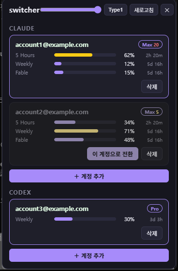
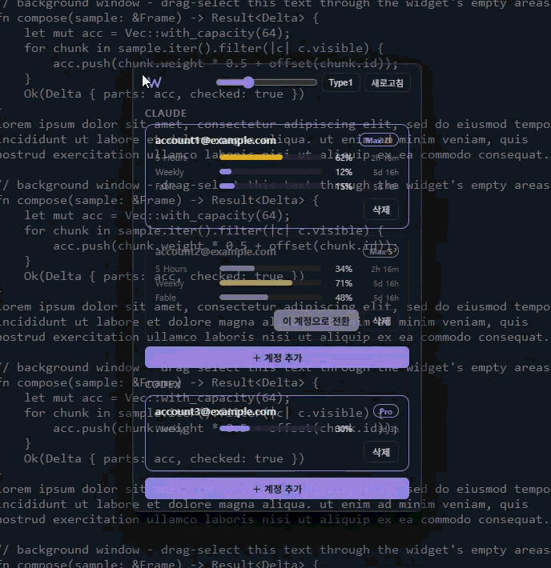

<h1> switcher</h1>

Claude Code와 Codex CLI 계정을 버튼 하나로 갈아타는 Windows 위젯.

A desktop widget that switches between multiple Claude Code / Codex CLI accounts in one click, with per-account usage bars.

## 다운로드

[**최신 버전 받기**](https://github.com/Youkamii/switcher/releases/latest) → `switcher-win-x64.zip`을 받아 압축을 풀고 `switcher.exe`를 실행하면 된다.


## 실행

- 압축을 푼 `switcher.exe`를 더블클릭하면 켜진다.
- 바탕화면 바로가기: `switcher.exe` 우클릭 → 보내기 → 바탕 화면에 바로 가기 만들기. 다음부터는 바탕화면에서 더블클릭으로 켠다.
- 켜져 있는 동안은 트레이(작업표시줄 오른쪽)에 W 아이콘으로 상주한다. 창을 닫아도(Alt+F4) 꺼지지 않고 트레이로 숨는다.
- 창을 다시 열려면 트레이의 W 아이콘을 좌클릭한다.
- 완전히 종료하려면 트레이 아이콘 우클릭 → 종료. 종료한 뒤에는 exe를 다시 실행하면 된다.
- 부팅할 때 자동으로 켜지게 하려면 `Win+R` → `shell:startup` 폴더에 exe 바로가기를 넣는다.

<p align="center"></p>

<p align="center"></p>

## 개요

Claude Code든 Codex든 한 터미널에서 사용할 때, 한 계정만 로그인된다. 다계정 유저는 한도가 찰 때마다 `/login`을 다시 하고, 브라우저 인증을 다시 거치고, 지금 어느 계정을 쓰고 있는지도 헷갈린다.

switcher는 이 과정을 없앤다. 계정마다 처음 한 번만 로그인해 두면, 그다음부터는 위젯에서 버튼 한 번으로 전환된다. 각 계정의 사용량(5시간·주간 한도)이 막대로 보이니, 어느 계정에 여유가 있는지 보고 갈아타면 된다.

## 기능

- 계정 전환: 재로그인 없이 버튼 한 번. 새로 여는 터미널부터 적용된다.
- 사용량 표시: 계정마다 5 Hours / Weekly / 모델별 한도와 리셋까지 남은 시간이 보인다.
- 계정 추가: 위젯이 로그인 링크를 보여주고, 브라우저는 마음대로 고른다. 지금 쓰는 계정은 건드리지 않는다.
- 구독 레벨: 계정 옆에 Max(5x는 노랑, 20x는 빨강) / Pro / Plus가 붙는다.
- 모드(Type1/2/3): 전체 → 위젯 → 컴팩트 순환. 위젯·컴팩트에서는 버튼이 숨고 클릭·드래그가 뒤 창으로 통과하며, 계정 카드를 더블클릭하면 전환된다. 창 이동은 ☰ 핸들.
- 창 높이는 내용에 맞춰 자동 조절된다. 투명도 슬라이더를 내리면 배경이 먼저, 골조가 나중에 옅어진다.

## 동작

두 CLI 모두 로그인 토큰을 로컬 파일에 저장한다.

- Claude Code: `~/.claude/.credentials.json`
- Codex CLI: `~/.codex/auth.json`

switcher는 계정별 토큰을 `~/.switcher/` 아래 프로필로 보관하고 전환할 때 두 단계로 파일을 교체한다.

1. 지금 활성 파일을 현재 계정 프로필에 백업한다. 토큰이 수시로 자동 갱신되므로 이 순서가 먼저여야 한다.
2. 대상 계정 프로필을 활성 위치로 복사한다.

대화 기록·메모리·설정은 계정과 무관한 로컬 폴더에 있어서 계정을 바꿔도 작업 환경은 그대로다.

사용량은 각 계정의 토큰으로 CLI가 쓰는 사용량 API를 직접 조회한다. 요청 제한을 피하려고 60초 캐시를 둔다. 조회가 막히면 직전 값을 보여준다.

계정 추가는 격리 로그인으로 처리한다.

## 계정 추가

위젯의 "＋ 계정 추가"를 누르면 로그인 주소가 나온다. 그 주소를 원하는 브라우저에 붙여넣는다.

- **Claude**: 브라우저에서 로그인하면 화면에 코드가 나온다. 그 코드를 위젯 입력칸에 붙여넣으면 끝.
- **Codex**: 위젯에 주소와 함께 일회용 코드(15분 유효)가 뜬다. 브라우저에서 그 코드를 입력하면 나머지는 자동이다.

참고: Claude CLI는 로그인을 시작할 때 기본 브라우저를 한 번 열려고 한다. 그 창은 닫아도 되고, 위젯의 주소를 붙여넣은 브라우저에서 진행하면 된다.

## 기술

Tauri 2 + Rust, 프론트는 바닐라 TypeScript. 계정 전환·사용량 조회·격리 로그인은 전부 Rust에서 처리한다.
웹뷰에는 토큰이 올라가지 않는다.
CLI 로그인 화면은 가상 콘솔(PTY)로 읽는다.

## 직접 빌드

받아서 쓰는 대신 소스에서 빌드하려면 Node.js와 Rust 툴체인이 필요하다.

```sh
git clone https://github.com/Youkamii/switcher.git
cd switcher
npm install
npm run tauri build   # 결과물: src-tauri\target\release\switcher.exe
```

개발 실행은 `npm run tauri dev`.

---

<div align="center">
<sub>Licensed under the <a href="LICENSE">MIT License</a> — free for any use, including commercial. Keep the copyright and license notice.</sub>
</div>
