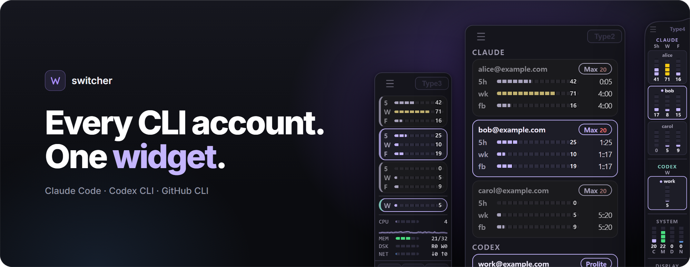
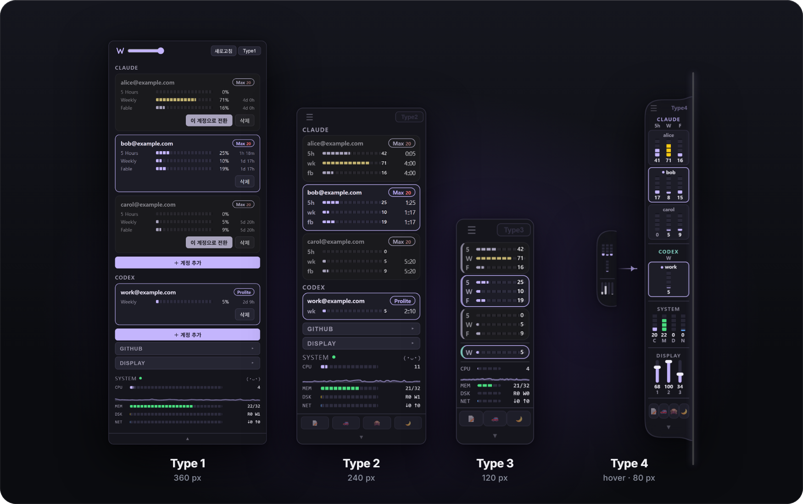
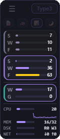
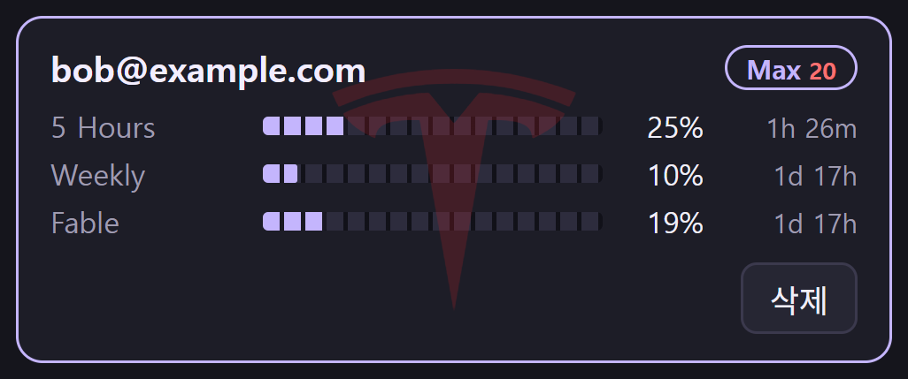
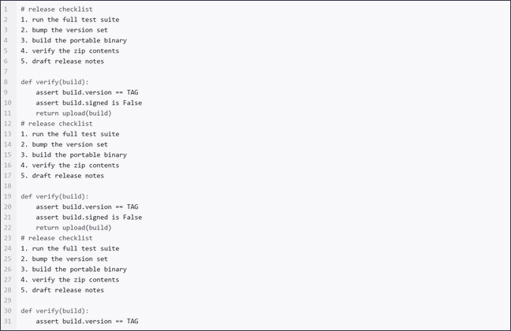
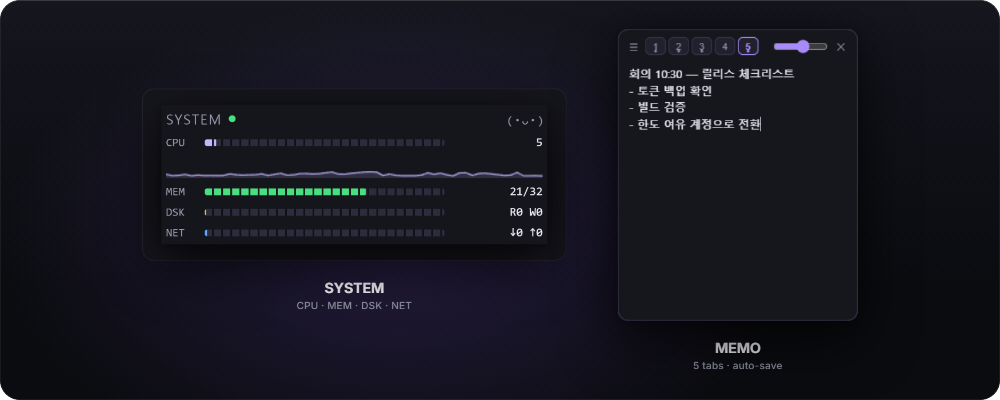

<p align="center">
  <a href="https://github.com/Youkamii/switcher/releases/tag/v1.8.5">
    
  </a>
</p>

<p align="center">
  <a href="https://www.npmjs.com/package/switcher-widget"></a>
  <a href="https://www.npmjs.com/package/switcher-widget"></a>
  <a href="../LICENSE"></a>
  
  
</p>

<p align="center">
  <strong>Switch Claude Code · Codex CLI · GitHub CLI accounts from one widget.</strong><br />
  Sign in once per account, then switch with a click — usage and reset times always in view.
</p>

<p align="center">
  <a href="#install">Install</a> ·
  <a href="#four-view-modes">Modes</a> ·
  <a href="#type-4--the-liquid-edge-widget">Type 4</a> ·
  <a href="#tfsd-autopilot">TFSD</a> ·
  <a href="#cheat-sheet">Cheat sheet</a> ·
  <a href="#data--security">Security</a> ·
  <a href="#troubleshooting">Troubleshooting</a>
</p>

<p align="center">
  <sub>
    <a href="../README.md">한국어</a> ·
    <strong>English</strong> ·
    <a href="README.ja.md">日本語</a> ·
    <a href="README.zh-CN.md">简体中文</a> ·
    <a href="README.zh-TW.md">繁體中文</a> ·
    <a href="README.hi.md">हिन्दी</a>
  </sub>
</p>

<br />

## Install

Two lines with Node.js 18 or newer. The first run downloads the official release that matches the npm package version.

```sh
npm install -g switcher-widget
switcher
```

<p align="center">
  <a href="https://github.com/Youkamii/switcher/releases/download/v1.8.5/switcher-win-x64-latest.zip"></a>
  &nbsp;
  <a href="https://github.com/Youkamii/switcher/releases/download/v1.8.5/switcher-mac-arm64-latest.zip"></a>
</p>

[Claude Code](https://docs.anthropic.com/en/docs/claude-code) and/or [Codex CLI](https://github.com/openai/codex) must be installed separately.

> [!NOTE]
> **The first launch shows an "unknown publisher" warning.** The release files carry no paid code signature; the files themselves are fine. Check that the download came from `github.com/Youkamii/switcher`, then:
> - **Windows** — in the SmartScreen dialog, **More info → Run anyway**
> - **macOS** — if it is blocked, open **System Settings → Privacy & Security**, scroll down and press **Open Anyway**. Or strip the download flag in Terminal: `xattr -dr com.apple.quarantine switcher.app`
> - The warning comes from the download flag that browsers attach. Installing with `npm install -g switcher-widget` leaves no flag, so Windows runs it without a warning; macOS works the same way.

<details>
<summary><strong>Adding accounts</strong> — Claude · Codex · GitHub</summary>
<br />

1. In Type 1, press **+ Add account** under Claude or Codex.
2. Open the address the widget shows in your browser.
3. Claude: paste the code from the browser into the widget. Codex: enter the one-time code (valid for 15 minutes) in the browser.
4. When sign-in finishes a card appears. The currently active account does not change.

Codex requires device-code authentication to be enabled on the ChatGPT account. Personal accounts: **Settings → Security → Codex device code authentication**. Team/Business accounts: a workspace admin enables it in the workspace permissions.

If [GitHub CLI](https://cli.github.com) is installed, a GITHUB section appears. Press **+ Add account** and approve the device code in your browser.
</details>

<br />

## Why switcher

Claude Code and Codex CLI use one account at a time. With several accounts you sign out, re-authenticate in the browser and paste a code every time a limit fills up — and you still have to check which account has room left. switcher keeps the CLI's local credential store per account and swaps it in whole.

| | By hand | switcher |
| --- | --- | --- |
| Switching | Sign out → browser auth → paste code | One click in the widget |
| Remaining limits | Sign in to each account to check | Every account on one screen |
| Hitting a limit | You find out when work stops | With TFSD on, switches at 90% |

- Shows the provider's **5-hour and weekly usage windows** with reset times, and keeps refreshing inactive profiles' tokens so their usage stays current.
- Syncs the Claude plan and **Max multiplier (5x · 20x) from the server** — upgrade without signing in again.

<br />

## Four view modes

<p align="center">
  
</p>

Cycle with the **Type** button at the top right. One widget scales from the full control panel down to an 80 px panel.

| Mode | What it is | Switch accounts |
| --- | --- | --- |
| **Type 1** | Full panel with account add/remove and every tool. Drag section titles to reorder | Button on the card |
| **Type 2** | Compact widget that keeps emails and plan info | Double-click a card |
| **Type 3** | 120 px widget with labels and usage bars only | Double-click a card |
| **Type 4** | A liquid handle on the screen edge that swells into an 80 px panel on hover | Click a card |



**It stays out of your way.**

- In Type 2/3, clicks and drags on empty areas pass through to the window behind.
- Transparency steps down from the background to the bars; at the lowest step only the usage bars remain.
- 🙈 blurs emails and GitHub user names, so the widget is safe to keep up while screen sharing.
- Type 2 shortens reset times: `h:mm` under 24 hours, `d::hh` beyond.

<br clear="all" />

## Type 4 — the liquid edge widget


New in **v2.0**. The widget rests as a handle on whichever screen edge is closer, swells into a panel when the mouse touches it, and seeps back when the mouse leaves.

- **Handle** — even collapsed, it shows the current Claude and Codex accounts' usage windows (e.g. 5h·W·F) and SYSTEM (CPU·MEM·DSK·NET) as thin bars.
- **Panel** — every account as vertical segmented bars with %, followed by SYSTEM, DISPLAY (a vertical brightness slider per monitor) and the tool dock. The active account has an accent-colored border and a dot before its name.
- **Switch** — a short click on another account card switches right away.
- **Time to reset** — press and hold the panel to replace the % with the time left: `4d` in blue, `2h` in green, `52m` in red.
- **Collapse** — about half a second after the mouse leaves, it returns to the handle. Drag ☰ past the middle of the screen to dock on the other edge.
- The expanded panel takes the mouse (no click-through). While collapsed, only the area outside the handle passes through.

<sub>Sample account names; the cursor was added in editing.</sub>

<br clear="all" />

## TFSD autopilot



**Token Full Self-Driving.** When one usage window of the active account reaches 90%, switcher moves to the account that has room in every window and the most headroom overall.

- Open the tool dock with ▲ at the bottom of the window and turn on 🚗, or enable it in the tray settings. While on, the active card shows a T watermark.
- If every window above 90% resets within 30 minutes, it waits instead of switching.
- Switching an account yourself turns it off immediately.
- History is written to `~/.switcher/tfsd-history.log`, which may contain account names and emails in plain text.

<br clear="all" />

## Tools that don't interrupt work

<p align="center">
  
</p>

**Black monitor** (🌙) covers the screen with a black overlay. Moving the cursor clears the area around it like smoke; shake the mouse hard for a second or two, or press `Esc`, to dismiss it. On Windows it also lowers the hardware brightness of monitors that support DDC/CI. On macOS it is overlay-only and cannot cover a separate Space with a full-screen app.

<p align="center">
  
</p>

**SYSTEM** shows CPU, memory, disk and network with a 60-second graph. **MEMO** (📝) opens a small window with five auto-saved tabs and its own transparency. **Clamshell mode** (☕) keeps terminal jobs running with the laptop lid closed, and **GitHub switching** changes the `gh` account together with its HTTPS Git credential helper.

| Feature | Windows | macOS |
| --- | :---: | :---: |
| Claude · Codex switching, usage, TFSD | ✓ | ✓ |
| Type 4 edge dock | ✓ | ✓ |
| GitHub switching | ✓ | ✓ |
| Click-through · transparency | ✓ | ✓ |
| DISPLAY brightness | External monitors (DDC/CI) | Built-in display |
| Black monitor | ✓ | ✓ ¹ |
| Clamshell sleep guard | ✓ | ✓ |
| Auto-update | ✓ | ✓ ² |
| Run at startup · 6 accent colors · 6 UI languages | ✓ | ✓ ³ |

<sub>¹ Cannot cover a separate Space with a full-screen app · ² Implemented and shipped; real-device verification of the latest path on a Mac is still pending · ³ Run at startup needs macOS 13+</sub>

<details>
<summary><strong>Clamshell mode and GitHub switching in detail</strong></summary>
<br />

**Clamshell** — press ☕ once to keep the machine awake until the lid is next opened, twice to keep it awake as long as the watcher process lives, even across app restarts. The original setting is restored on normal exit and reboot; if the watcher dies abnormally, the next launch repairs the setting and turns the feature off.

- Windows: stores the current power plan's AC and battery lid actions, then sets them to `Do nothing`. If the plan changes while enabled, the new plan is stored too; on release only the values switcher changed are reverted.
- macOS: stores and restores `SleepDisabled`, asking for admin approval once when enabling.

**GitHub** — switches the `github.com` account signed in to [GitHub CLI](https://cli.github.com). It runs `gh auth setup-git` for HTTPS remotes, so GitHub CLI's global HTTPS credential helper follows the switch. SSH remotes, `git config user.name/email`, and VS Code/Copilot sign-ins are not affected. GitHub Enterprise hosts are not supported.
</details>

<br />

## Cheat sheet

| I want to… | How |
| --- | --- |
| Change the view mode | **Type** button at the top right cycles 1 → 2 → 3 → 4. In Type 4, use the **Type4** button on the expanded panel |
| Switch accounts | Type 1: button on the card · Type 2/3: **double-click** a card · Type 4: **click** a card |
| See time to reset | **Press and hold** the Type 4 panel |
| Move Type 4 to the other edge | Drag ☰ past the middle of the screen |
| Reorder sections | Drag section titles in Type 1 |
| Use the window underneath | Empty areas in Type 2/3 and the area outside the collapsed Type 4 handle pass clicks through |
| Open the tool dock | **▲** at the bottom of the window: 📝 memo · 🚗 TFSD · 🙈 privacy · ☕ clamshell · 🌙 black monitor |
| Dismiss the black monitor | Shake the mouse hard for 1–2 s, or `Esc` |
| Clamshell mode | ☕ once until the lid opens, twice to keep it on |
| Quit completely | **Quit** in the tray menu — closing the window does not quit |

switcher lives as a **W** icon in the Windows notification area or the macOS menu bar. Language, auto-update, run at startup, TFSD, accent color and visible sections are in the tray settings. **Check for updates** in the tray applies the update and restarts the app.

<br />

## Data & security

There is no switcher server. The app reads and writes the local CLI credential stores; usage queries and token refreshes go straight to Anthropic or OpenAI. GitHub credentials are managed by `gh`, and updates come from GitHub Releases.

> [!IMPORTANT]
> Account profiles contain real credentials. Copies are stored as local files without app-level encryption, created with `0600` permissions on Unix-like systems. Never attach credential files from `~/.switcher`, `~/.claude` or `~/.codex` to issues or logs.

The switch order is fixed on purpose: **① back up the active credentials into the current profile, ② then copy the chosen profile into the active location.** This keeps the newest token the CLI refreshed on its own. Token values are never printed to logs or error messages.

Conversation history, memory and project settings are separate from credentials and survive a switch. A Claude Code or Codex session that is already running may keep the credentials it loaded at start, so open a new terminal after switching to be sure.

<details>
<summary><strong>File locations</strong></summary>
<br />

| What | Where |
| --- | --- |
| Active Claude credentials · Windows | `~/.claude/.credentials.json` |
| Active Claude credentials · macOS | Keychain item `Claude Code-credentials`; the file may also be written for CLI compatibility |
| Active Codex credentials | `~/.codex/auth.json` |
| Claude profile copies | `~/.switcher/claude/profiles/<name>/` |
| Codex profile copies | `~/.switcher/codex/profiles/<name>/` |
| TFSD history | `~/.switcher/tfsd-history.log` |
</details>

<br />

## Supported platforms

| Target | Release file | Status |
| --- | --- | --- |
| Windows 10 1803+ / 11 x64 | `switcher-win-x64-latest.zip` | Supported |
| macOS Apple Silicon | `switcher-mac-arm64-latest.zip` | Supported |
| Windows ARM64 | x64 emulation | Not verified on real hardware |
| macOS Intel | None | Not supported (building from source works) |
| Linux | None | Not supported |

npm installs, auto-updates and direct downloads from the [download archive](https://github.com/Youkamii/switcher/releases/tag/v1.8.5) all use the same release files.

> [!WARNING]
> Release files are not signed or notarized with Windows Authenticode or a macOS Developer ID. The auto-updater checks the GitHub origin, file size and embedded version, and the npm launcher only downloads from a fixed GitHub address — but neither verifies a cryptographic signature or a published checksum.

<br />

## Troubleshooting

<details>
<summary><strong>The first launch is blocked</strong></summary>
<br />
The release files are not code-signed. Windows: <strong>More info → Run anyway</strong>. macOS: <strong>System Settings → Privacy &amp; Security → Open Anyway</strong> (recent macOS no longer offers right-click → Open), or in Terminal <code>xattr -dr com.apple.quarantine switcher.app</code>. Confirm the download came from this repository's GitHub Releases first. Installing through npm leaves no download flag, so Windows runs it without a warning.
</details>

<details>
<summary><strong>Adding a Codex account is rejected at the approval step</strong></summary>
<br />
Device-code authentication must be enabled on the ChatGPT account: <strong>Settings → Security</strong> for personal accounts, or the workspace permissions set by an admin for team accounts.
</details>

<details>
<summary><strong>I switched accounts but an open CLI still uses the old one</strong></summary>
<br />
A running session may hold the credentials it loaded at start. Restart Claude Code or Codex in a new terminal.
</details>

<details>
<summary><strong>I deleted a profile but it came back after switching</strong></summary>
<br />
Deleting removes only the stored copy, not the sign-in. Because switching backs up the current account automatically, the active account's profile can reappear. To remove it for good, switch to another account first, then delete.
</details>

<details>
<summary><strong>Screen brightness doesn't change</strong></summary>
<br />
Windows: enable DDC/CI in the monitor's OSD menu; some monitors and connections do not support it. The macOS build supports the built-in display only and shows an unsupported notice for external monitors.
</details>

<br />

## Development & contributing

```sh
git clone https://github.com/Youkamii/switcher.git
cd switcher
npm ci
npm run tauri dev
```

| Task | Command |
| --- | --- |
| Front-end geometry regression tests | `npm test` |
| Front-end build · type check | `npm run build` |
| Rust check · tests | `cd src-tauri && cargo check` · `cargo test` |
| Windows portable build | `npm run tauri build -- --no-bundle` |
| macOS app build | `npm run tauri build -- --bundles app` |

Build output lands in `src-tauri/target/release/switcher.exe` on Windows and `src-tauri/target/release/bundle/macos/switcher.app` on macOS.

Built with Tauri 2 and Rust, with vanilla TypeScript and Vite on the front end. Account switching, sign-in (PTY for Claude, device code for Codex), usage queries and system integration are all Rust commands; the webview is WebView2 on Windows and WKWebView on macOS. Running the release workflow for a tag uploads the Windows and macOS files to the download archive and then publishes the npm package.

Bug fixes, docs, translations and real-device verification are all welcome. Open an [issue](https://github.com/Youkamii/switcher/issues) first for larger changes, and list the OS you tested on and the checks you ran in your pull request. Never put real tokens, account files or the contents of `~/.switcher` in commits, screenshots or issues. For macOS, follow the [verification checklist](MAC_VALIDATION_PROMPT.md).

<br />

<p align="center">
  <a href="../LICENSE">MIT License</a> · free for personal and commercial use<br />
  <sub>switcher is an independent open-source project, not affiliated with or endorsed by Anthropic, OpenAI or GitHub.</sub>
</p>
